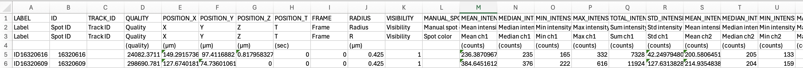
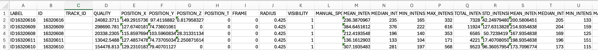
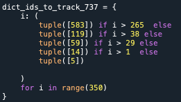
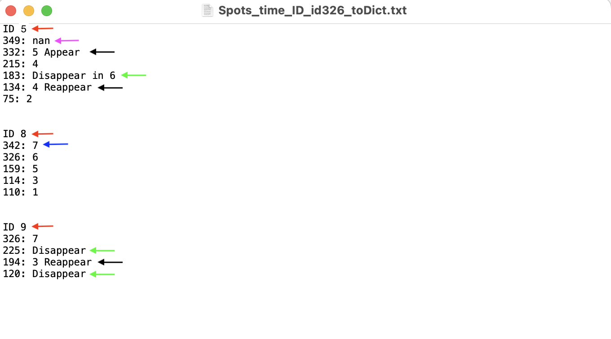

# Centrioles tracking pipeline in single cells

These python scripts were originally written to allow the tracking of centrioles/centrin foci in muscles cells of Zebrafish. They can also be used with any other 3D + t images to track centrioles. 
If you have 2D images, this will not work, since many places in the code are written considering there is three dimensions. However, if you know Python a bit, you can easily spot such places and adapt it to work on 2D + t images.
Alternatively, you can also look to [2D_version_attempt.py](./Scripts_Computer/2D_version_attempt.py), the short script attempt written for Gabriella and Zhansaya project.  

\
In case you should have any questions not addressed here about my code, you can contact me at florian.curvaia@me.com

## Table of Contents
1. [Introduction](#intro)
   
   1.1 [First steps in Fiji](#intro_fiji)
   
   1.2 [How to install conda](#intro_conda)
   
   1.3 [How to use the HPC-cluster](#intro_hpc)

2. [Tracking pipeline: step by step](#track_pip_main)
   
   2.1 [First script: run_stardist_live_to_segmentation.py](#script1_main)

   2.2 [Second script: run_btrack_cluster.sh](#script2_main)

   2.3 [Third script: run_time_track_nuc_coords_parallel.py](#script3_main)

   2.4 [Fourth script: run_live_2d_spots_to_3d_cluster.py](#script4_main)

   2.5 [Fifth script: Curate_spots.py](#script5_main)

   2.6 [Sixth script: Curate_tracks.py](#script6_main)

   2.7 [Seventh script: Make_Dict_Tracks.py](#script7_main)

   2.8 [Eighth script: Make_nuc_Dict_track.py](#script8_main)

   2.9 [Ninth script: Dist_spot_nuc.py](#script9_main)

   2.10 [Tenth script: Wrap_up_make_all_plots.py](#script10_main)

   
   

## 1. Introduction <a name="intro"></a>

In the documentation, I explain in details the detection + tracking pipeline. It is not working too bad to detect and track centrioles on live images acquired with the Viventis SPIM, but further improvement could defenitely be made.
If you wish to do so, the best place to start is to improve the tracking of the centrioles by playing with the parameters of the different [btrack](https://btrack.readthedocs.io/en/latest/index.html) [models](./btrack_models) to find the parameters that best suit your purpose. Afterhand, if you have the time to do so, you can also train a [StarDist](https://github.com/stardist/stardist) model based on your own manual annotations of nuclei segmentation.  

The code in this repository is not clean, since I did not had the time to tidy my code. If you are not familaiar at all with python, you should know that lines of code that begins with a `#`are comments and thus are not executed and that when a line or multiple ones are between three quotation marks such as `""" text """` they are not executed as well.  
&nbsp;
&nbsp;
### 1.1 First steps in Fiji <a name="intro_fiji"></a>

After having obtained the images from the SPIM, you should time-register them using BigDataProcessor2 plug-in in Fiji. There, they have a pretty easy to use functionality that let you click on the same nucleus along the whole movie, and then save these coordinates in a .json file that you can then use to apply track drift correction on the images. Once done, you should crop the ROI you are interested in in the image and save the cropped images.
Warning: This step can be very long ! Finding the right crop for your ROI, as well as saving the cropped image to the server can take together up to some days. To speed up things, it is recommended to only save the images in 3D (folder called *volumes*) and not do max projections yet. Once the 3D cropped image has been saved, you can open them in Fiji and do max projection there and save it. To open the images for a single channel, just drag and drop the volumes folder in which the images are saved, and then in the Filter section just enter *C00* if you want only the first channel or *C01* if you want the second channel. When the files are opened, you might have to re-arrange the hyperstack dimensions to get the images in the right order. Keep the max projections open for each channels, and then merge the channels and save everything in one single file.

Once you have both 3D images and max projections for your cropped image, you can detect the spots using TrackMate plug-in in Fiji on the max-projected images. You can then save the spots detected to a csv file. For my images, the spots were detected using the following settings: LoG detection, 0.75 radius and approx. 21.18 for the quality threshold.  

Once you saved the spots to a csv file, you'll need to open it and remove [the three bottom lines of the header](#im_spot_csv_bf) to only keep [the first one](#im_spot_csv_af). Then when done, save the csv file.  
Be careful, depending on the settings of your computer and of the application you use to remove the extra header lines, when you save it back to disk, it might save your file with values separated by semi-colon ";" instead of comma ",". If this should be the case, either change the settings of your computer/application, or change the way the csv files are loaded in python by replacing the "," by ";" in the lines where you see `pd.read_csv()`.  

##### Before removing the three extra header rows <a name="im_spot_csv_bf"></a>
 


##### After removing the three extra header rows <a name="im_spot_csv_af"></a>
 


&nbsp;
&nbsp;
### 1.2 How to install conda <a name="intro_conda"></a>

Before the next steps, which are all done in python, make sure to have properly installed everything needed. This is, conda on your account on the hpc-cluster (e.g. Jed), and conda on your computer. To install conda on your account on the hpc-cluster follow the instructions given [here for Linux](https://docs.anaconda.com/miniconda/miniconda-install/). For this to work, you will need to upload the *miniconda.sh* file to your */home directory* (e.g. using CyberDuck, see the [section below](#intro_hpc)). For your local computer, just check the appropriate section depending on the OS of your computer. When this is done, you should install the following two environments: *stardist-env* and *btrack-env*.
To install *stardist-env*, here are the instructions:
On the cluster:
```bash
conda create -y -n stardist-env python=3.9
conda activate stardist-env
pip install cenfind
```
On your computer:
```bash
conda create -y -n stardist-env python=3.9
conda activate stardist-env
conda install -c conda-forge pyqt
conda install ffmpeg
pip install napari
pip install cenfind
pip install napari-animation
pip install stardist-napari
pip install spyder-kernels==2.5.*
```
To install *btrack-env*, here are the instructions:
On the cluster:
```bash
conda create -y -n btrack-env python=3.9
conda activate btrack-env
pip install btrack
```
On your computer:
```bash
conda create -y -n btrack-env python=3.9
conda activate btrack-env
conda install -c conda-forge pyqt
conda install ffmpeg
pip install btrack[napari]
pip install napari
pip install napari-animation
pip install spyder-kernels==2.5.*
pip install napari-tracks-reader
```
Be careful, when using conda, once you used the `pip install` command to install a python package, you **MUST NOT** use the `conda install` command anymore after that. Therefore, all the packages that require to be installed with `conda install` (such as ffmpeg, pyqt, etc.) should be installed before using `pip install` as it is shown here. If you find yourself needing to install new packages after that, please install them with `pip install` if possible. If it is possible only with conda, remove the previous environment and re-install the whole by making sure to install the packages requiring conda before the rest. If you are not using spyder to execute and modify your python script, you can skip the `pip install spyder-kernels==2.5.*` line. 
To activate the desired environment, just type `conda activate env-name` in the terminal.
For the scripts which need to be run on an hpc-cluster, I recommend using the jed cluster of EPFL, and [CyberDuck](https://cyberduck.io/download/) on MacOS (download it from this [link](https://cyberduck.io/download/) to get the free version) or [WinSCP](https://winscp.net/eng/index.php) on windows to manage your files stored on the cluster. To run the scripts on your local computer, I recommend using a python IDLE such as [Spyder](https://www.spyder-ide.org), [PyCharm](https://www.jetbrains.com/pycharm/) or [Visual Studio Code](https://code.visualstudio.com). If you do not wish to install an IDLE on your computer, you can also open a terminal window, activate your conda environment and then run the `python` command to open the python interpreter and copy and paste there the chunks of code you want to run. However, if you are not at ease with coding in python, I would not recommend this solution.  
&nbsp;
&nbsp;
### 1.3 How to use the HPC-cluster <a name="intro_hpc"></a>

Before diving into the step-by-step description of the tracking pipeline, I am explaining here how the HPC-cluster works, how to use it and how to run scripts there. 
To connect to the Jed HPC of EPFL, open a terminal window and type the following command:   
`ssh gaspar@jed.epfl.ch` where you replace *gaspar* by your actual gaspar name from EPFL.  
It will then ask to enter your password, just type your gaspar password. Note that it is normal if you don’t see any character printing when doing so, when done with typing your password just press the enter key of your keyboard. If this gives you a permission denied error, check that you are part of an [EPFL group](https://groups.epfl.ch/#/home/member-groups?mode=member&query=&status=all&owner=&member=375715&admin=&pageindex=0&pagesize=10&sortcolumn=name&sortdirection=asc) that has access to the cluster.  
To work on Jed you have access to three personal directories: */home/gaspar*, */scratch/gaspar*, */work/gaspar*. The home directory is where you will have your important files such as the conda installation, your python scripts and the models for stardist and btrack. The memory limit on home is low, so do not store your data there. For your data and images, I would recommend using the scratch directory, this has unlimited memory, it is the directory that is accessed the faster by your scripts (which reduces scripts’ execution time by a lot) but all the files older than 30 days might be automatically deleted without notice, so make sure to keep a copy of all the files that are in scratch somewhere else. The work directory is a pay-per-use directory to store your data, without any memory or time-limit. As in principle you should only need to use the cluster for the first steps, which are quite quick, I recommend using */scratch* over */work*. For any trouble, not addressed here, that you might encounter when using the cluster, you can check the official documentation of EPFL [here](https://scitas-doc.epfl.ch).  
At the beginning of each session on the cluster, you need to source conda by running the following command:  
`source /home/gaspar/miniconda/etc/profile.d/conda.sh` where gaspar should be replaced by your gaspar name. If this doesn’t work, you can use `find . -name "conda.sh"` to locate where */miniconda/etc/profile.d/conda.sh* is installed.  
When this is done, you can then use the `conda activate` command to activate the environment that you need to run your scripts (e.g. `conda activate stardist-env`). To run a python script on the cluster, you need to run first a script that will define the resources needed for the execution and then will call your core python script to be executed. These files are all names *run_name_of_python_script*, where *name_of_python_script* is the name of the corresponding python script that will be called by the *run* script. The run script and the corresponding python script should all be stored in the */home* directory. Important: if you are not part of the upgon group/account for the jed cluster, then you have to modify the run scripts as follow: open them in a text editor and locate the line:  
`#SBATCH --account=upgon` and change *upgon* by the name of your group/account. 
The run scripts that are bash files (ending in *.sh*) should be run using the `sbatch` command. The run scripts that are python files (ending in *.py*) should be run using the `python` command. Before running a script for the first time on the cluster, open the corresponding run script and locate this line:  
`#SBATCH -o /home/gaspar/outputs/some_thing/out_%a.txt` where *gaspar* is your gaspar name and *some_thing* is the name of a folder specific for each file.  
Make sure that the folder *some_thing* corresponding to the script you want to run has been created in the *outputs* folder. This will contains errors files in which you can see the errors and warning that were returned by python during execution, which is useful to correct mistakes that might be present in your scripts; and out files which will contain anything what would have been printed in the console of your python interpreter if you were running the script on your computer. Before beginning, also make sure to have uploaded the [stardist_models](./stardist_models) and [btrack_models](./btrack_models) folders into your home directory on the cluster. Important: before running any script, you should open both the run script and the associated python script, and search for all the occurrence of **curvaia** (just do Cmd/Ctrl + F) in the script (except the headline `@author: floriancurvaia`) and replace it with your own gaspar.  
&nbsp;
&nbsp;
## 2. Tracking pipeline: step by step <a name="track_pip_main"></a>

### 2.1 First script: [run_stardist_live_to_segmentation.py](./Scripts_HPC_Cluster/run_stardist_live_to_segmentation.py) <a name="script1_main"></a>

#### Pre-requisites: <a name="script1_req"></a>
You should have installed the conda environment *stardist-env*, activated it by running the `conda activate stardist-env` command. You should have uploaded to your *home* directory the [stardist_models](./stardist_models) folder and to your *scratch* directory the *volumes* folder that you got from Fiji. In the same folder in which *volumes* is stored, you should create a */tif_seg* and a */npy_seg* folders. [stardist_nuc_seg_live.py](./Scripts_HPC_Cluster/stardist_nuc_seg_live.py) is the associated python script. You should also create a *stardist_live* folder in your *outputs* folder located in your *home* directory.

#### Parameters of the script: <a name="script1_par"></a>
There is only one argument for the script, which is the path to the *volumes* folder. If your pixel size is something else than 0.75, 0.173, 0.173 in respectively Z, Y and X, you have to go in the [stardist_nuc_seg_live.py](./Scripts_HPC_Cluster/stardist_nuc_seg_live.py) file and locate the following line:  
`y, _ = model.predict_instances(x, scale=(1,0.23,0.23), n_tiles=n_tiles)` and replace the scale argument (given in Z, Y, X order) such that your pixel sizes in Z, Y and X divided by the corresponding number you give to the scale argument is equal to 0.75.

#### How to run the script: <a name="script1_how"></a>
Use the following command:  
`python run_stardist_live_to_segmentation.py /path_to_volumes_folder`  
where `/path_to_volumes_folder` is the path to the folder *volumes* that you uploaded. For example for me it was:  
`/scratch/curvaia/Transplants_e1_2/Muscles_part2/volumes` 

#### Output: <a name="script1_out"></a>
The script will output nuclei segmentation across all time points in two formats: in tif file in the */tif_seg* folder and in numpy array in the */npy_seg* folder. The *npy_seg* folder should be downloaded to your computer or to your group share, since it will be needed for the scripts that will be run from your computer. However, downloading large data from the hpc-cluster can take substantial amount of time, so you can do so when you will be done with all the scripts that need to run on the cluster so you don’t keep the files occupied.  
&nbsp;
&nbsp;

### 2.2 Second script: [run_btrack_cluster.sh](./Scripts_HPC_Cluster/run_btrack_cluster.sh) <a name="script2_main"></a>

#### Pre-requisites: <a name="script2_req"></a>
You should have installed the conda environment *btrack-env*, activated it by running the `conda activate btrack-env` command. You should have uploaded to your *home* directory the [btrack_models](./btrack_models) folder.

#### Parameters of the script: <a name="script2_par"></a>
There is no proper argument to this script. All the path to the necessary folders (*volumes* and *npy_seg*) should be adapted directly in the script. If your pixel size is something else than 0.75, 0.173, 0.173 in Z, Y and X, you should locate the `scale=(0.75, 0.173, 0.173)` line and change the values by your pixel size in Z, Y and X.

#### How to run the script: <a name="script2_how"></a>
Use the following command:  
`sbatch run_btrack_cluster.sh`

#### Output: <a name="script2_out"></a>
The script will output a file named *btrack_cells_Muscle_v2.h5* that contains the btrack tracking of the nuclei and another file named *nuc_coords_Muscles_V2.npy* which contains the TrackID, TimePoint, Z, Y and X coordinates of all the nuclei. They should be downloaded to your computer or to your group share, since they will be needed for the scripts that will be run from your computer.  
&nbsp;
&nbsp;

### 2.3 Third script: [run_time_track_nuc_coords_parallel.py](./Scripts_HPC_Cluster/run_time_track_nuc_coords_parallel.py) <a name="script3_main"></a>

#### Pre-requisites: <a name="script3_req"></a>
You should have installed the conda environment *btrack-env*, activated it by running the `conda activate btrack-env` command. You must create a folder *Nuc_seg_time_track* next to the *volumes* and *npy_seg folders*. 

#### Parameters of the script: <a name="script3_par"></a>
There is only one argument for the script, which is the path to the *npy_seg* folder. If your pixel size is something else than 0.75, 0.173, 0.173 in respectively Z, Y and X, you have to go in the [time_track_nuc_coords_parallel.py](./Scripts_HPC_Cluster/time_track_nuc_coords_parallel.py) file and locate the following line `scale=(0.75, 0.173, 0.173)` and change the values by your pixel size in Z, Y and X.

#### How to run the script: <a name="script3_how"></a>
Use the following command:  
`python run_time_track_nuc_coords_parallel.py /path_to_npy_seg_folder`
where `/path_to_npy_seg_folder` is the path to the folder *npy_seg*. For example for me it was:  
`/scratch/curvaia/Transplants_e1_2/Muscles_part2/npy_seg`

#### Output: <a name="script3_out"></a>
The script will output nuclei segmentation across all time points in numpy format in the */Nuc_seg_time_track*. This contains the nuclei segmentation where nuclei labels have been replaced by their TrackID in each time point. The *Nuc_seg_time_track* folder should be downloaded to your computer or to your group share, since it will be needed for the scripts that will be run from your computer. Keep in mind that downloading large data from the hpc-cluster can take substantial amount of time.  
&nbsp;
&nbsp;

### 2.4 Fourth script: [run_live_2d_spots_to_3d_cluster.py](./Scripts_HPC_Cluster/run_live_2d_spots_to_3d_cluster.py) <a name="script4_main"></a>

#### Pre-requisites: <a name="script4_req"></a>
You should have installed the conda environment *btrack-env*, activated it by running the `conda activate btrack-env` command. You should have created a folder named *Centrioles_spots_3D* next to the *volumes* and *npy_seg* folders. You should have uploaded the csv file containing the 2d location of the spots.

#### Parameters of the script: <a name="script4_par"></a>
There is only one argument for the script, which is the path to the volumes folder. There is one thing that needs to be changed in the script for any new experiment. Open [live_2d_spots_to_3d_cluster.py](./Scripts_HPC_Cluster/live_2d_spots_to_3d_cluster.py) and look for the following line: 
`path_in_spots = Path("/scratch/curvaia/Transplants_e1_2/Muscles_part2/e2-1_muscles2_max_proj_allspots_d1_4_Q5_8.csv")`  
You should replace the string inside the *Path()* function by the path to the csv file containing the 2d location of spots.
If your pixel size is something else than 0.75, 0.173, 0.173 in respectively Z, Y and X, you have to go in the [live_2d_spots_to_3d_cluster.py](./Scripts_HPC_Cluster/live_2d_spots_to_3d_cluster.py) file and locate the following line `scale=(0.75, 0.173, 0.173)` and change the values by your pixel size in Z, Y and X.

#### How to run the script: <a name="script4_how"></a>
Use the following command:  
`python run_live_2d_spots_to_3d_cluster.py /path_to_volumes_folder`
where `/path_to_volumes_folder` is the path to the folder *volumes* that you uploaded. For example for me it was:  
`/scratch/curvaia/Transplants_e1_2/Muscles_part2/volumes`

#### Output: <a name="script4_out"></a>
The script will output in the *Centrioles_spots_3D* folder one csv file for each time point with the coordinates of the spots in 3D. This folder should be downloaded to your computer or to your group share, since it will be needed for the scripts that will be run from your computer.  
&nbsp;
&nbsp;

### 2.5 Fifth script: [Curate_spots.py](./Scripts_Computer/Curate_spots.py)  <a name="script5_main"></a>

#### Pre-requisites: <a name="script5_req"></a>
This is the first script to be run on your own computer. It is also the case for all the following scripts, except if clearly mentioned otherwise. You should have installed the conda environment *btrack-env* on your computer. If you use an IDLE to open and run the script, go in the settings of your IDLE and select the python interpreter located in your btrack-env. Normally this setting should remain the same if you don't change it, even after closing and re-opening your IDLE. This means that in theory you should not have to do that each time that you open your IDLE, given that all the remaining scripts need to be run in the *btrack-env* conda environment. However, I am not an expert in all the IDLE, so it is possible that what I've just stated is not true for all of them. If you run each chunk of the script using the python interpreter in the terminal, make sure to run the `conda activate btrack-env` command before running the `python` command in the terminal.
You should have the *volumes* folder, as well as the *Centrioles_spots_3D* and *Nuc_seg_time_track* folders and *btrack_cells_Muscle_v2.h5* file downloaded from the hpc-cluster, either stored in your computer or in the share of your group.


#### Parameters of the script: <a name="script5_par"></a>
For all the scripts that are being run on your computer, all the arguments/parameters are located inside the script, and therefore should be changed directly there.  
`path_in_spots` is the path to the *Centrioles_spots_3D* folder.  
`path_in_C1` and `path_in_C2` are both the path to the *volumes* folder.  
`path_in_C3` is the path to the *Nuc_seg_time_track* folder.  
Inside the `with btrack.io.HDF5FileHandler` parentheses, you should replace the path by the path to the *btrack_cells_Muscle_v2.h5* file.  
The `path_out_im` is the path where plots will be saved if you decide to plot some data from this script and is also the directory where all the main files related to your cell of interest (csv file of spots, tracks, etc.) will be stored.  
The `path_config` should be the path to the [btrack-models](./btrack_models) folder.  
If your pixel size is something else than 0.75, 0.173, 0.173 in respectively Z, Y and X, locate the following line `scale=(0.75, 0.173, 0.173)` and change the values by your pixel size in Z, Y and X.


#### How to run the script: <a name="script5_how"></a>
The goal of this script is to only select the spots that belongs to the cell you want to analyse.  
If you analyse a muscle cell that has corner spots, I would advise you to treat separately the "normal" spots and the corner spots. That is, to run once this script and all the following ones to the end for the normal spots and after that re-do the same for the corner spots.  
The script is composed of 3 different parts that should be run one after the other, since some additional steps on your side are required in-between.  
Each part begins with a line of comment:  
`###PART 1 of the script`,  
`###PART 2 of the script` and  
`###PART 3 of the script`.  
To run each part just select the code that is part of it and click on the button of your IDLE that lets you execute only your selection, or just copy and paste the part in the python window if you are using the terminal. To run parts 2 and 3 you need to have run before in the same session the preceding part, respectively 1 and 2.  
After running the first part, it will open a napari window with both channels, the nuclei segmentation and the tracking of the nuclei (layer called *data*). In the tracking layer, don’t forget to tick the *show ID* option to show the tracks ID. On napari, you can switch between 2D and 3D view by clicking on the square icon on the bottom left panel (second icon from the left on the icons panel).  

Once you found a cell that you want to analyse, you should look at all the tracking IDs that it takes through time and fill a python dictionary with them (see [this image](#im_dict)). In the example given [below](#im_dict), you can see that:  
for all time points above 265 (meaning 266 and onwards), the TrackID was 583,  
for all time points above 38 up to 265 it was 119,  
between 30 and 38 it was 59,  
between 2 and 29 it was 14 and  
below 2 it was 5.  
If at one time point, your nucleus of reference does not appear in the tracks (e.g. it was not recognized as a nucleus by StarDist, just put a large number as the ID for this time point, e.g. 10000. This number should be large enough that it does not correspond to any tracks that were created by the tracking algorithm).  
Make sure to write this dictionary after the other dictionaries called `dict_ids_to_track_737`, otherwise yours will be overwritten.  

##### Example of python Dictionnary with the track ID of a nucleus through time <a name="im_dict"></a> 
 

 
Once this is done, you can run part 2.  
This will extract from the spot files the spots that are the closer to the nucleus you are interested in. The goal is to only keep the spots close to the nucleus/cell you picked and discard the others. This will open a new point layer on napari with the selected spots. Now you have to review the spots frame by frame, to remove the spots that might not belong to your cell and add the spots belonging to your cell but that are not shown here (either they were too far, thus not selected, or they were not detected by TrackMate).  

You can save your progression in the curation at any time, by running the part 3 of the script. Before doing so, make sure to change the *Cell_ID*, to match the number that you chose to be the unique identifier of your cell (Usually, I use the TrackID that is present in the most time point). This *Cell_ID* will then be used to identify the cell and the files and folders associated to it for the rest of the pipeline. Thus, avoid choosing two times the same ID !  
To start back where you ended in case you saved and quitted, just uncomment the three lines at the beginning of the script and follow the instructions given there. In any case, when you are done with the curation, *you need to run part 3 to save your curation* to a new csv file, if you do not do it, everything will be lost !

#### Outputs: <a name="script5_out"></a>
This script will output a csv file named *cur_spots_t349_idCell_ID.csv* where *Cell_ID* is the unique identifier that you chose for your cell. It contains all the spots associated to your cell of interest.  
&nbsp;
&nbsp;

### 2.6 Sixth script: [Curate_tracks.py](./Scripts_Computer/Curate_tracks.py)  <a name="script6_main"></a>

#### Pre-requisites: <a name="script6_req"></a>
This must be run on your computer. In addition of the same pre-requisites than the [5th script](#script5_req), you must have run [the latter](#script5_main) before running this one.

#### Parameters of the script: <a name="script6_par"></a>
All parameters/arguments present in this script are already described in the [parameters section of the 5th script](#script5_par). Please refer to it. 

#### How to run the script: <a name="script6_how"></a>
The goal of this script is to perform the tracking of the spots that were selected and curated in the previous script.  

Before running the script, please replace the `dict_ids_to_track_540`, by your `dict_ids_to_track_737` object that you defined in the previous [script](#script5_how) (just copy the definition of the object in script 5 and paste it in script 6 instead of `dict_ids_to_track_540`).  
You can run the whole script at once this time, unlike the previous script. This will open a napari windows. The tracking of the spots is the layer named data_spots. For this layer as well don’t forget to tick the *Show ID* option.  

Now it is time to curate the tracks. Depending on how meticulous and dedicated you are, it can take up to several days or a full week. In the case of muscle cells, where you can have many very dynamic spots (up to 9 at the same time have been observed in my case), so sometimes it can be very tricky to determine the track of a spot between two time points. In case of easier cells (max 2 spots), this step can be really quick (no more than an afternoon to finish the whole pipeline).  
To curate the tracks, open your favourite text editor and open a new text file named *Spots_time_ID_idCell_ID_toDict.txt* where you replace *Cell_ID* by [the ID you chose previously](#im_dict) for your cell of interest. The curation of the tracks is done backwards in time, so you have to start to the last time point.  
To explain and illustrate how to fill this text file with the tracks' curation, I will use the example of the text file shown [below](#im_spot_tracks_cur).  

To start, identify all the spots present at the last time point and their ID.  
For each one, add one line with the following structure:  
`ID Spot_ID` where you replace *Spot_ID* with the TrackID that you see on the last time point in Napari (see [red arrows](#im_spot_tracks_cur)).  


Then, each time a spot changes ID in Napari, write a new line below with the following structure:  
`tp: Spot_New_ID` where *tp* is the timepoint at which the change occurs and *Spot_New_ID* the new ID of the spot backwards in time starting from this time point (note that there must be a space after the colon : but not before).  
For example, if the ID of the spot initially labelled as 8 changes to 7 at the time point 342, then you would have:  
`342: 7` (see [blue arrow](#im_spot_tracks_cur))  
Repeat this each time a spot changes ID. If when going backwards in time, there are spots that suddenly appear (meaning that they disappear when we go forward in time),  
then add a new line `ID Spot_ID` with the ID of the newly appeared spot as the *Spot_ID*. If the ID is already being used, you can use any other number that is free.  
Then below, add the following line:  
`349: nan` (see [pink arrow](#im_spot_tracks_cur))  
After that, add another line of the structure:  
`tp: New_Spot_ID Appear` where *tp* is the time point at which the spot appears and *New_Spot_ID* is the ID of this spot at that moment.  
For example, if a spot appears at the time point 332 with the ID 5, just write the following:  
`ID 5` (see [red arrow](#im_spot_tracks_cur))  
`349: nan` (see [pink arrow](#im_spot_tracks_cur))  
`332: 5 Appear` (see [black arrow](#im_spot_tracks_cur))  


If a spot disappears in another spot (e.g. they become too close to be distinguished), then add a line of the structure:  
`tp: Disappear in Remaining_Spot_ID` where *tp* is the time point at which it happens and *Remaining_Spot_ID* is the ID of the spot in which the other spot disappears.  
For example if at the time point 183, the spot that had the ID 4 at the time point 184 disappears into the remaining spot with the ID 6 at time point 183, you should mark:  
`183: Disappear in 6` (see [green arrow](#im_spot_tracks_cur))  
If later, the spot that disappeared is reappearing, just write a line with:  
`tp: New_ID_Spot Reappear` where *tp* is the time point at which the spot reappears and *New_ID_Spot* is the ID with which the spot is reappearing.  
For example if the spot previously disappeared reappears at time point 134 with the ID 4, you should mark:  
`134: 4 Reappear` (see [second black arrow](#im_spot_tracks_cur))  


Finally, if a spot simply disappears (e.g. its signal fades), then just write `Disappear` instead of `Disappear in Remaining_Spot_ID` (see [second green arrow](#im_spot_tracks_cur)).  
If the spot was not present at the beginning of the imaging, meaning that when doing the curation backwards, the spot disappears and never reappears, just let a blank line after the line where you act the disappearance of the spot (see [third green arrow](#im_spot_tracks_cur)).  


Now repeat the exact same process with the nuclei of the cell you are interested in. If your cell has a single nucleus, this should be easy, you can use the `dict_ids_to_track_737` to know what to write, without having to go through all the images again. Write everything in a text file named *Nuc_time_ID_idCell_ID_toDict.txt*.

###### Example of a text file used for tracks curation <a name="im_spot_tracks_cur"></a>



#### Outputs: <a name="script6_out"></a>
This script doesn’t properly have any output, but after running it and before going to the next one, you should have filled the text file *Spots_time_ID_idCell_ID_toDict.txt* where you curate the tracks of the different spots of your cell of interest. **Before moving on to the next script**, make sure that the spots are sorted in numerical order in the *Spots_time_ID_idCell_ID_toDict.txt* file (e.g. the spot which main ID (the ID on the first row of a spot) is 9, is after one spot which main ID is 4).  
&nbsp;
&nbsp;

### 2.7 Seventh script: [Make_Dict_Tracks.py](./Scripts_Computer/Make_Dict_Tracks.py)  <a name="script7_main"></a>
#### Pre-requisites: <a name="script7_req"></a>
This must be run on your computer. In addition of the [same pre-requisites than the 6th script](#script6_req), you must have run [the latter](#script5_main) before running this one and have your file *Spots_time_ID_idCell_ID_toDict.txt* ready.

#### Parameters of the script: <a name="script7_par"></a>
`path_files` is the path in which the csv file of the spot, as well as the text file with the tracks annotations are located. In the previous script, it was usually called path_out_im.  
`Cell_ID` is the ID of the cell you are interested to.  
`N_tracks` is the total number of individual spots that you have in your cell (e.g. if you have in total 5 unique tracks in the cell along the whole time range, put 5).  
`last_tp_tracks` is a list in which you have to write the main ID of each unique spot (which is the ID appearing on the first row of the spot), in numerical order.  
For `scale`, see [previous scripts](#script5_par).

#### How to run the script: <a name="script7_how"></a>
This script can be run all at once without further precautions. 

#### Outputs: <a name="script7_out"></a>
This scripts outputs two csv files:  
*all_cur_spots_idCell_ID.csv* and *all_cur_spots_idCell_ID_w_Merge.csv* in which the tracks of the spots are corrected according to the annotation.  
The w_Merge file contains tracks for which when a spot was said to disappear in another spot, they receive the same track ID for this period of time.  
&nbsp;
&nbsp;

### 2.8 Eighth script: [Make_nuc_Dict_track.py](./Scripts_Computer/Make_nuc_Dict_track.py)  <a name="script8_main"></a>
This script just does exactly the same thing as [the previous script](#script7_main), so just refers to the explanation of it.  
In addition, it also outputs a numpy array with the centre of the cell in each time point computed as the centre point between all the nuclei of the cell.  
&nbsp;
&nbsp;
### 2.9 Ninth script: [Dist_spot_nuc.py](./Scripts_Computer/Dist_spot_nuc.py)  <a name="script9_main"></a>
#### Pre-requisites: <a name="script9_req"></a>
Having run [the previous script](#script8_main).

#### Parameters of the script: <a name="script9_par"></a>
The only new parameter is `new_scale`. This is similar to scale, but instead of being (Z, Y, X) it is (T, Z, Y, X) with `T=1`. 

#### How to run the script: <a name="script9_how"></a>
Just run everything at once

#### Outputs: <a name="script9_out"></a>
The script computes at each time point the distance of each spot to the closest nucleus belonging to the cell of interest. It also gets the intensity values of all the pixels belonging to a spot (see [the last chunk of the script](#https://github.com/UPGON/Zfish_Centrioles_Tracking_Pipeline/blob/a6f08beca6ce2cb0e536b9f7ddf20951aac82e0c/Scripts_Computer/Dist_spot_nuc.py#L195-L231)).  
It outputs the csv file named *all_cur_spots_idCell_ID_w_dist.csv* of the spots with two new columns, which are the ID of the closest nucleus and the distance to it, as well as a dictionary containing the intensity values of each spot at each time point called:  
*dict_spots_fluo_values_r2_5_xy0_75_z1_66_per_tp_idCell_ID.pkl*.  
&nbsp;
&nbsp;

### 2.10 Tenth script: [Wrap_up_make_all_plots_Clean.py](./Scripts_Computer/Wrap_up_make_all_plots_Clean.py)  <a name="script10_main"></a>
#### Pre-requisites: <a name="script10_req"></a>
Having run [the previous script](#script9_main). You must also create a next to *volumes* a folder named *Spots_seg_trackID_idCell_ID_final*. You must create/choose a folder where you want the subfolders containing the plots of each cell that you analyse to be. Inside this folder, create a folder named *mean_fluo_vs_time_idCell_ID*, as well as a folder named *Z_corr*. In the *Z_corr* folder make another folder named *mean_fluo_vs_time_idCell_ID*.


#### Parameters of the script: <a name="script10_par"></a>
`Muscle_cells`: set to True if the cell you analyse is a Muscle one and has Corner spots that have already been curated.  
`Open_napari`: set to True if you wish to open Napari at the end of the execution of the script.  
`Record_Movie`: Always let this to False. If you wish to record a movie, just run the last chunk of code after having open Napari.  
`Fluo_V2`: Just let that alwas to True.  
`Z_corr`: set to True if you wish to perform correction of intensity along Z and T (Not recommended, except if for your cell/images you see a clear correlation between intensity values and Z or T).  
`log_corr`: set to True if you wish the Z-correction to be log-based (not recommended).  
`N_unique_spots`: Number of unique spots (=unique tracks) in your cell.  
`path_in_C5`: path to the *Spots_seg_trackID_idCell_ID_final* folder.  
`path_out_movies`: path to the folder where you want to save your movies.  
`path_out_im`: path to the folder containing the *mean_fluo_vs_time_idCell_ID* and the *Z_corr* folders.  
`path_config`: path to the [btrack-models](./btrack_models) folder.  


#### How to run the script: <a name="script10_how"></a>
You can run it in one single chunk. Before running the script, you should copy your `dict_ids_to_track_737` from [Curate_spots.py](#im_dict) and paste it to replace the `dict_ids_to_track_737` that is already present in the script.  

#### Outputs: <a name="script10_out"></a>
This script is the core script of the pipeline. It is here that the magic happens after having curated the spots detection and the spots tracking.  
It will output multiple plots to show different things (e.g. intensity of each spot over time, distance to closest nucleus over time, frequence of the change in direction of each spot, etc.). 


