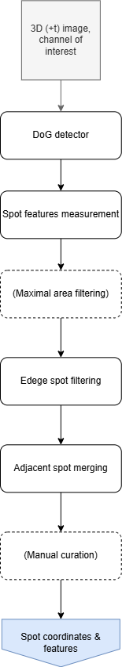

# 3. Detection pipeline
This document describes the steps of the spot detection pipeline. Such a pipeline allows detection of bright spots on a dark background from a given image channel and curation of the detection results.

## 3.1 Pipeline documentation
The pipeline requires running specific scripts in a specific order. Please refer to the appropriate script documentation.

1. [Spot detection](src/detection/blob_detection.md): Detect spots from a given channel
2. [Manual curation](src/curation/coords_curation.md) (Optional): Curate the spot detection results


## 3.2 Schematic representation 
<div style="text-align: center; background-color: white; padding: 12px;">
  
</div>

## 3.3 Suggested folder structure 

```
experiment
├── images.tif            <- original, raw images from the experiment
├── subsets           
│   └── s1_images.tif           <- subset of the original images, can notably contain its cropped version. We usually run the detection on image subsets
└── results           
   └── detection
        ├── curated 
        │   └── cX_res
        │       ├── instructions
        │       │   ├── add.txt     <- instructions with the information of spots to add to the spot detection results
        │       │   └── remove.txt      <- instructions with the information of spots to remove from the spot detection results
        │       ├── cX_centers_curated.csv  <- curated 3D (+t) coordinates and features (area & intensity) of the detected spots 
        │       └── curate_coords.bat       <- command to curate the spot detection coordinates
        └── raw 
            ├── cX_res
            │   ├── cX_centers.csv      <- 3D (+t) coordinates and features (area & intensity) of the detected spots 
            │   ├── cX_detection_img.tif        <- TIFF images with the channel image, bright field and detected spot annotations
            │   └── cX_params.csv       <- parameters used for the detection
            └── blob_detection_cX.bat        <- command to run the spot detection script
```