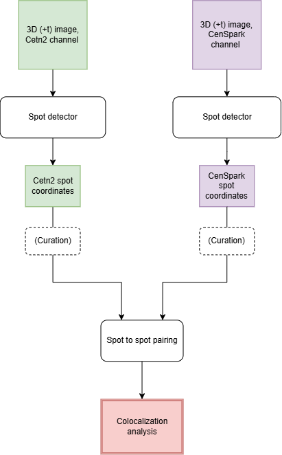

# 4. Colocalization analysis
In this document, we describe the steps required to perform a colocalization analysis on a given image.
This pipeline allows the colocalization of signals from 2 different channels, from spot detection to spot pairing and colocalization quantification.

## 4.1 Pipeline documentation
The pipeline requires running specific scripts in a specific order. Please refer to the appropriate script documentation.

1. [Spot detection](src/detection/blob_detection.md): Detect spots from a given channel. Perform this step for the 2 channels whose colocalization you want to verify.
2. [Manual curation](src/curation/coords_curation.md) (Optional): Curate the spot detection results. Perform this step for the 2 channels whose colocalization you want to verify.
3. [Spot to spot pairing](src/analysis/colocalization_analysis.md): Pair spots from the different channels and quantify their colocalization.

## 4.2 Schematic representation 
<div style="text-align: center; background-color: white; padding: 12px;">
  
</div>


## 4.3 Suggested folder structure 

```
experiment
├── images.tif            <- original, raw images from the experiment
├── subsets           
│   └── s1_images.tif           <- subset of the original images, can notably contain its cropped version. We usually run the detection on image subsets
└── results  
    ├── colocalization
    │   └── raw/curated 
    │       ├── pairing_results
    │       │   ├── images
    │       │   │   ├── annotated_pairing_detection.tif     
    │       │   │   └── colocalizing_mask.tif     
    │       │   ├── plots
    │       │   │   ├── colocalization_proportion_plot.png    
    │       │   │   ├── detection_count_plot.png    
    │       │   │   ├── detection_proportion_plot.png    
    │       │   │   ├── diff_z_distance_plot.png  
    │       │   │   ├── intensity_comparison_plot.png    
    │       │   │   ├── pairing_distance_xy_plot.png  
    │       │   │   ├── pairing_distance_z_plot.png    
    │       │   │   └── radius_comparison_plot.png  
    │       │   ├── features.csv
    │       │   ├── pairing_results.csv
    │       │   └── statistics.csv
    │       └── colocalization_analysis.bat
    │
    └── detection
        └── raw/curated
            ├── c1_res
            │   ├── c1_centers.csv      <- 3D (+t) coordinates and features (area & intensity) of the detected spots 
            │   ├── c1_detection_img.tif        <- TIFF images with the channel image, bright field and detected spot annotations
            │   └── c1_params.csv       <- parameters used for the detection
            ├── c2_res
            │   ├── c2_centers.csv      <- 3D (+t) coordinates and features (area & intensity) of the detected spots 
            │   ├── c2_detection_img.tif        <- TIFF images with the channel image, bright field and detected spot annotations
            │   └── c2_params.csv       <- parameters used for the detection
            ├── blob_detection_c1.bat        <- command to run the spot detection script
            └── blob_detection_c2.bat        <- command to run the spot detection script
```